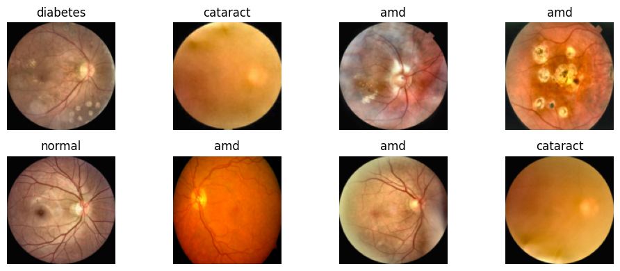
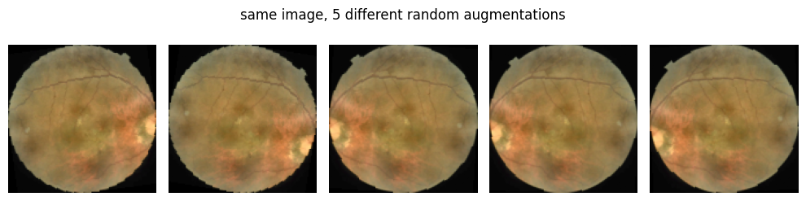
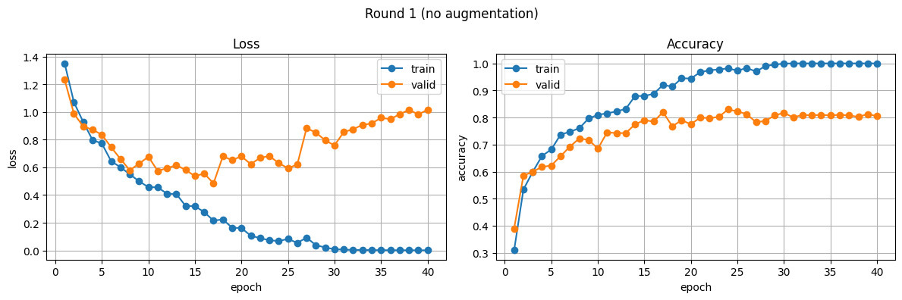
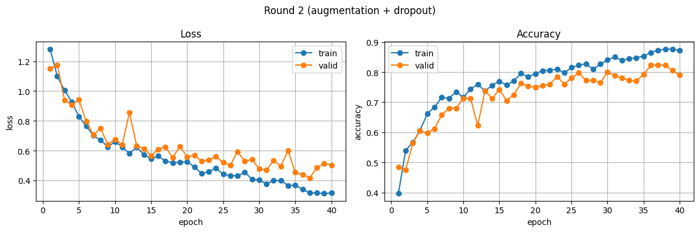
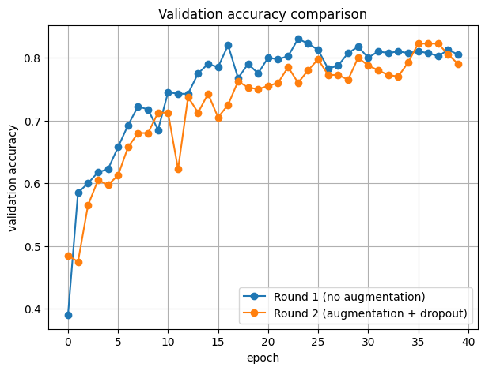
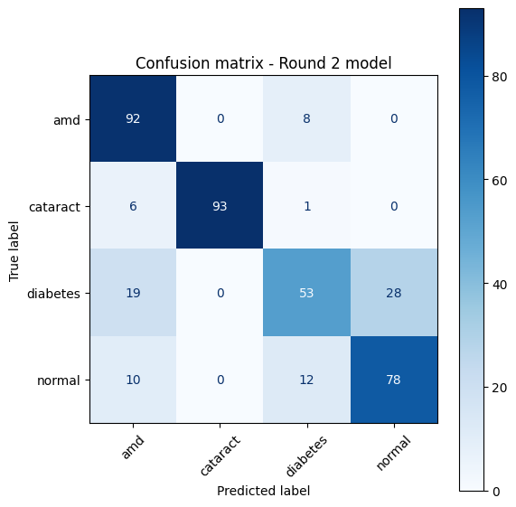
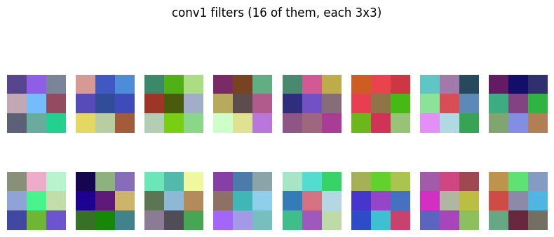
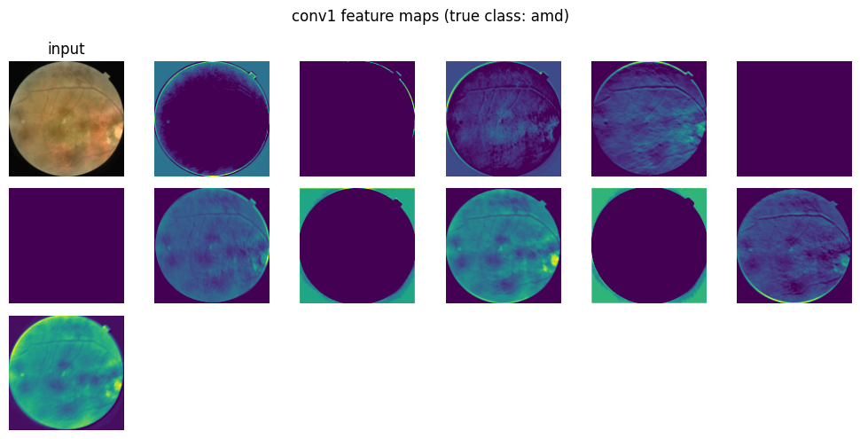

# Eye Disease Classification from Fundus Images — CNN from Scratch (PyTorch)

[](https://colab.research.google.com/github/mamunsayed/amdnet23-cnn-eye-disease-classification/blob/main/CNN_AMDNet23.ipynb)


A compact convolutional neural network, built from scratch in PyTorch, that classifies retinal fundus images into **4 classes — AMD, Cataract, Diabetic Retinopathy and Normal** — using the AMDNet23 dataset.

The project is designed as a **controlled experiment on overfitting**: the same architecture is trained twice — once without regularization and once with data augmentation + dropout — to show, with numbers and curves, how regularization changes generalization.

> Developed for the *Computer Vision & Pattern Recognition* course at American International University-Bangladesh (AIUB).

---

## TL;DR

| | Round 1 — no regularization | Round 2 — augmentation + dropout |
|---|---:|---:|
| Peak train accuracy | 100.0% | 87.6% |
| Peak validation accuracy | 83.0% | 82.25% |
| **Train–validation gap** (peak vs. peak) | **17.0%** ❌ | **5.4%** ✅ |
| Best validation loss | 0.485 | **0.416** |
| Validation loss at epoch 40 | 1.02 | 0.504 |
| Validation accuracy at epoch 40 (final model) | 80.5% | 79.0% |

**Takeaway:** regularization did not raise peak accuracy, but it closed the train–validation gap from 17% to ~5% and kept validation loss from exploding — the Round 2 model is the more trustworthy one.

---

## Dataset

**AMDNet23: Fundus Image Dataset for Age-Related Macular Degeneration Disease Detection** — [Mendeley Data](https://data.mendeley.com/datasets/yj35kjgrv3/1)

| Class (folder name) | Meaning |
|---|---|
| `amd` | Age-related Macular Degeneration |
| `cataract` | Cataract |
| `diabetes` | Diabetic Retinopathy |
| `normal` | Healthy retina |

| Split | Images |
|---|---:|
| Train | 1,594 |
| Validation | 400 (100 per class — balanced) |

The dataset is **not included** in this repository. Download it from the link above and arrange it as:

```
AMDNet23 Dataset/
├── train/   (amd/, cataract/, diabetes/, normal/)
└── valid/   (amd/, cataract/, diabetes/, normal/)
```



---

## Model Architecture

`SimpleCNN` — three convolution blocks followed by a two-layer classifier head.

```
Input: 3 × 128 × 128 (RGB)
│
├── Conv2d(3 → 16, 3×3, pad=1)  → ReLU → MaxPool(2)   →  16 × 64 × 64
├── Conv2d(16 → 32, 3×3, pad=1) → ReLU → MaxPool(2)   →  32 × 32 × 32
├── Conv2d(32 → 64, 3×3, pad=1) → ReLU → MaxPool(2)   →  64 × 16 × 16
│
├── Flatten (16,384) → Dropout(p)
├── Linear(16,384 → 128) → ReLU → Dropout(p)
└── Linear(128 → 4)   → class scores
```

- **Trainable parameters:** 2,121,380
- `p = 0.0` in Round 1, `p = 0.3` in Round 2 — the same class is reused so the comparison is fair.

## Training Setup

| Setting | Value |
|---|---|
| Image size | 128 × 128 |
| Batch size | 32 |
| Optimizer | Adam (lr = 0.001) |
| Loss | CrossEntropyLoss |
| Epochs | 40 (both rounds) |
| Random seed | 0 (`torch.manual_seed`, `np.random.seed`) |
| Hardware | Google Colab GPU |

### The two rounds

| | Round 1 | Round 2 |
|---|---|---|
| Train transforms | Resize + ToTensor | Resize + **RandomHorizontalFlip + RandomRotation(10°)** + ToTensor |
| Dropout | 0.0 | **0.3** |
| Validation transforms | Resize + ToTensor | Resize + ToTensor (kept clean) |

**Tuning note:** a first attempt at Round 2 used ColorJitter + dropout 0.5 — the regularization was too strong and the model underfit. It was dialed back to flip + small rotation and dropout 0.3.



---

## Results

### Round 1 — overfitting

Training loss falls to ~0.001 and training accuracy reaches 100%, while validation loss bottoms out at epoch 17 (0.485) and then climbs back to ~1.02 by epoch 40 — the model is memorizing the training images.



### Round 2 — regularized

Training and validation curves move together; the gap stays small and validation loss reaches its best value (0.416) late in training.



### Validation accuracy — side by side



### Per-class performance (final Round 2 model, validation set)

| Class | Precision | Recall | F1-score |
|---|---:|---:|---:|
| AMD | 0.72 | 0.92 | 0.81 |
| Cataract | **1.00** | 0.93 | **0.96** |
| Diabetic Retinopathy | 0.72 | **0.53** | 0.61 |
| Normal | 0.74 | 0.78 | 0.76 |
| **Macro average** | 0.79 | 0.79 | 0.79 |

Overall accuracy: **79%** (400 images).



### Error analysis

- **Cataract is the easiest class** (F1 0.96) — its global haze is visually distinct from the other conditions.
- **Diabetic Retinopathy is the hardest** (recall 0.53). 28 of 100 DR images were predicted as *Normal* — the most costly error clinically, because it means a missed diagnosis. Early DR lesions (micro-aneurysms, small haemorrhages) are tiny and are likely lost when images are downscaled to 128×128.
- **AMD is over-predicted** (precision 0.72): 19 DR, 10 Normal and 6 Cataract images were labelled AMD.

---

## Inside the Network

First-layer filters and the feature maps they produce for an AMD image. Some channels respond to the retina boundary, others to vessels and bright lesion areas; a few are inactive (all-dark maps).




---

## Repository Structure

```
amdnet23-cnn-eye-disease-classification/
├── CNN_AMDNet23.ipynb   # Full pipeline: data loading, model, both training rounds, evaluation, visualizations
├── images/              # Figures exported from the notebook (used in this README)
├── requirements.txt
└── README.md
```

## How to Run

**Option A — Google Colab (recommended)**

1. Click the **Open in Colab** badge above.
2. Upload the dataset to your Google Drive.
3. Update `DATA_DIR` in *Step 2* to your folder path (default: `/content/gdrive/MyDrive/AMDNet23 Dataset`).
4. Runtime → Change runtime type → **GPU**, then *Run all*.

**Option B — Local**

```bash
git clone https://github.com/mamunsayed/amdnet23-cnn-eye-disease-classification.git
cd amdnet23-cnn-eye-disease-classification
pip install -r requirements.txt
jupyter notebook CNN_AMDNet23.ipynb
```

Remove the two `google.colab` / `drive.mount` lines and point `DATA_DIR` to your local dataset folder.

---

## Limitations

- **No separate test set.** The validation set was used both to monitor training and to report results, so the numbers are likely slightly optimistic.
- **No checkpointing.** The reported per-class metrics come from the epoch-40 model (79%), not the best epoch (82.25%).
- **Single run, single seed** — no variance estimate across runs.
- **Low input resolution (128×128)** limits detection of small lesions, which hurts Diabetic Retinopathy recall.

## Future Work

- [ ] Train / validation / **test** split with best-checkpoint saving and early stopping
- [ ] Transfer-learning baseline (ResNet / EfficientNet) for comparison with the from-scratch CNN
- [ ] Higher input resolution and class-weighted loss to improve DR recall
- [ ] **Grad-CAM** heatmaps to check whether the model looks at clinically relevant regions
- [ ] Refactor the notebook into reusable `train.py` / `evaluate.py` scripts

---

## Author

**Md. Sayed Mamun** — BSc in Computer Science & Engineering, AIUB
[LinkedIn](https://linkedin.com/in/md-sayed-mamun-725976276) · [GitHub](https://github.com/mamunsayed)

## Acknowledgements

Dataset: *AMDNet23: Fundus Image Dataset for Age-Related Macular Degeneration Disease Detection* ([Mendeley Data](https://data.mendeley.com/datasets/yj35kjgrv3/1)). Related paper: [AMDNet23 (arXiv:2308.15822)](https://arxiv.org/abs/2308.15822). All dataset credit goes to the original authors.

> ⚠️ This is an academic project and is **not intended for clinical use**.
